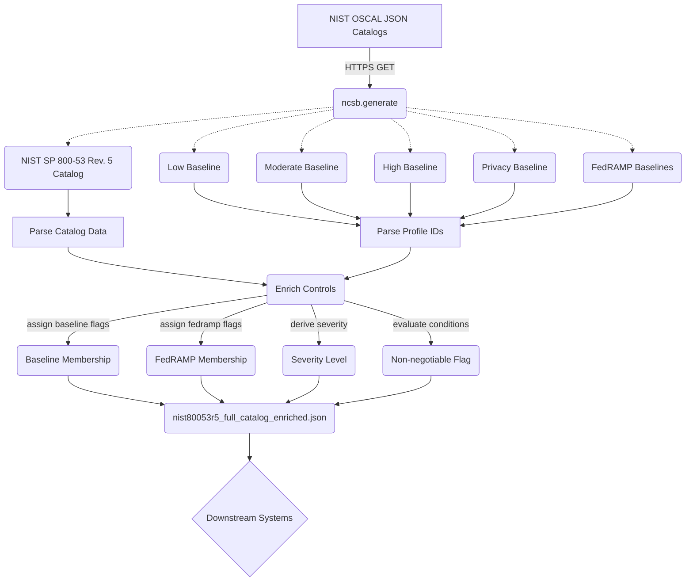

# NIST Cloud Security Baseline (NCSB)

**NCSB** publishes a daily, machine-readable, cloud-agnostic security baseline derived from authoritative NIST publications. Fetch it directly — no install required:

```
https://openastra.org/ncsb/catalog/v0.1/latest.json
```

The catalog merges the full NIST SP 800-53 Rev. 5 control catalog with SP 800-53B baseline profiles and FedRAMP OSCAL baselines, enriching every control with baseline membership flags, a derived severity level, and a non-negotiable indicator.

## Why this exists

Cloud security teams need a common starting point that is vendor-neutral:

- **NIST SP 800-53 Rev. 5** defines *what* security controls exist (1,000+ controls and enhancements across 20 families like Access Control, Audit, System Protection, etc.).
- **NIST SP 800-53B** defines *which* controls belong to the Low, Moderate, High, and Privacy baselines.
- **FedRAMP Baselines** define the controls required for cloud service providers serving the US government (LI-SaaS, Low, Moderate, High).

These documents are published as separate JSON profiles by NIST and the GSA. NCSB downloads them, joins the data, and enriches every control with baseline membership flags, a derived severity level, and a non-negotiable indicator — all in one JSON file you can feed into policy engines, compliance dashboards, IaC scanners, or cloud-provider mapping tools.

## Distribution

The catalog is published daily at a stable URL — no package to install.

| Artifact | URL | Updated |
|---|---|---|
| Latest catalog | `https://openastra.org/ncsb/catalog/v0.1/latest.json` | daily |
| Historical catalog | `https://openastra.org/ncsb/catalog/v0.1/historical/YYYY-MM-DD.json` | daily |
| JSON Schema | `https://openastra.org/ncsb/schema/v0.1/ncsb.json` | on schema change |
| YAML Schema | `https://openastra.org/ncsb/schema/v0.1/ncsb.yaml` | on schema change |

Schema version (`v0.1`) is bumped only when the catalog output structure changes, creating a new versioned URL path.

## Features

- **Zero configuration** — downloads source OSCAL profiles directly from NIST and the GSA FedRAMP automation repo; no local data files to maintain.
- **Enriched output** — every control gets `severity` (LOW / MEDIUM / HIGH / CRITICAL) and `non_negotiable` (boolean) fields derived from configurable rules.
- **Baseline membership** — flags each control's presence in the NIST (Low, Moderate, High, Privacy) and FedRAMP (LI-SaaS, Low, Moderate, High) baselines.
- **Parent-enhancement linkage** — enhancement controls (e.g. `AC-2(1)`) are linked back to their parent (`AC-2`).
- **Configurable** — override any source URL or rule via CLI flags.
- **CI-ready** — ships with a GitHub Actions workflow that regenerates the baseline daily and commits the result.

## Quick start

Fetch the catalog directly:

```bash
curl -s https://openastra.org/ncsb/catalog/v0.1/latest.json | jq '.count'
```

To run the generator locally (e.g. for self-hosting or development):

```bash
git clone https://github.com/sadayamuthu/nist-cloud-security-baseline.git
cd nist-cloud-security-baseline
python -m venv .venv && source .venv/bin/activate
pip install -e ".[dev]"
python -m ncsb.generate --out baseline/nist80053r5_full_catalog_enriched.json
```

## CLI options

| Flag | Default | Description |
|------|---------|-------------|
| `--out` | `nist80053r5_full_catalog_enriched.json` | Output file path |
| `--non_negotiable_min_baseline` | `moderate` | Minimum baseline for `non_negotiable=true` (`moderate` or `high`) |
| `--controls_csv_url` | NIST catalog URL | Override the controls CSV source |
| `--baseline_low_csv_url` | NIST Low baseline URL | Override the Low baseline CSV |
| `--baseline_moderate_csv_url` | NIST Moderate baseline URL | Override the Moderate baseline CSV |
| `--baseline_high_csv_url` | NIST High baseline URL | Override the High baseline CSV |
| `--baseline_privacy_csv_url` | NIST Privacy baseline URL | Override the Privacy baseline CSV |
| `--fedramp_lisaas_url` | FedRAMP LI-SaaS baseline URL | Override the FedRAMP LI-SaaS CSV |
| `--fedramp_low_url` | FedRAMP Low baseline URL | Override the FedRAMP Low CSV |
| `--fedramp_moderate_url` | FedRAMP Moderate baseline URL | Override the FedRAMP Moderate CSV |
| `--fedramp_high_url` | FedRAMP High baseline URL | Override the FedRAMP High CSV |
| `--version` | | Print version and exit |

## Code Flow Design



## Output schema

The generated JSON has this top-level structure:

```json
{
  "project": "NIST Cloud Security Baseline (NCSB)",
  "project_version": "0.1.0",
  "generated_at_utc": "2026-02-18T06:00:00Z",
  "framework": "NIST SP 800-53 Rev. 5",
  "reference": { "publication": "...", "downloads": "..." },
  "rules": { "severity_definition": { ... }, "non_negotiable_min_baseline": "moderate" },
  "count": 1189,
  "controls": [ ... ]
}
```

Each item in `controls[]`:

| Field | Type | Example |
|-------|------|---------|
| `control_id` | string | `AC-2` or `AC-2(1)` |
| `control_name` | string | `Account Management` |
| `family` | string | `AC`, `AU`, `SC`, ... |
| `control_text` | string | Full control statement |
| `discussion` | string | Supplemental guidance |
| `related_controls` | string | Comma-separated IDs |
| `parent_control_id` | string or null | `AC-2` (for enhancements) |
| `baseline_membership` | object | `{ "low": true, "moderate": true, "high": true, "privacy": false }` |
| `fedramp_membership` | object | `{ "li_saas": false, "low": false, "moderate": true, "high": true }` |
| `severity` | string | `LOW` / `MEDIUM` / `HIGH` / `CRITICAL` |
| `non_negotiable` | boolean | `true` |

## Severity and non-negotiable rules

**Severity** is assigned based on the *earliest* (least restrictive) baseline a control appears in:

| Condition | Severity |
|-----------|----------|
| In Low baseline | `MEDIUM` |
| In Moderate (not Low) | `HIGH` |
| In High (not Low or Moderate) | `CRITICAL` |
| Privacy-only | `MEDIUM` |
| Not in any baseline | `LOW` |

**Non-negotiable** defaults to `true` when a control is in the Moderate or High baseline. Pass `--non_negotiable_min_baseline high` to restrict it to High-only.

## Project structure

```
nist-cloud-security-baseline/
├── spec/
│   ├── VERSION              # schema version (semver → URL path)
│   └── schemas/
│       ├── ncsb-v0.1.json   # JSON Schema for catalog output
│       └── ncsb-v0.1.yaml   # YAML equivalent
├── src/ncsb/
│   ├── __init__.py
│   ├── __main__.py
│   ├── generate.py
│   └── urls.py
├── tests/
│   ├── test_generate.py
│   ├── test_oscal_id.py
│   └── test_schema_validation.py
├── baseline/
│   └── historical/
├── .github/workflows/
│   ├── develop.yml
│   ├── main-release.yml
│   └── schema-release.yml
├── pyproject.toml
├── Makefile
└── LICENSE
```

## Automation (GitHub Actions)

Two workflows handle publishing:

**`main-release.yml`** — runs daily at 06:00 UTC (and on push to `main`, or manually):
1. Runs the test suite across Python 3.11, 3.12, and 3.13
2. Generates `baseline/nist80053r5_full_catalog_enriched.json` and commits it to this repo
3. Pushes `latest.json` and a dated historical copy to `openastra.org/ncsb/catalog/v0.1/`
4. Creates a GitHub Release (tag + changelog — the catalog URL is the artifact)

**`schema-release.yml`** — triggers only when `spec/**` changes:
1. Reads `spec/VERSION` (semver), validates it, checks the tag doesn't already exist
2. Pushes `ncsb.json` and `ncsb.yaml` to `openastra.org/ncsb/schema/v0.1/`
3. Creates a GitHub Release tagged `spec-v{VERSION}` with schema files attached

To bump the schema version (e.g. when the catalog output structure changes), update `spec/VERSION` and add the new schema files to `spec/schemas/`.

## Development

We use `make` to streamline everyday tasks.

```bash
# install in editable mode with dev tools
make install-dev

# run tests
make test

# run tests and enforce 100% coverage
make test-cov

# auto-format code
make format

# lint code and run tests with coverage
make check
```

## Data sources

All data is fetched live from the official NIST downloads page and GSA GitHub repository:

- [NIST SP 800-53 Rev. 5 Downloads](https://github.com/usnistgov/oscal-content)
- [GSA FedRAMP Automation](https://github.com/GSA/fedramp-automation)

If NIST or GSA changes file names or paths, update `src/ncsb/urls.py` or pass the correct URLs via CLI flags.

## License

MIT (for this repository's code). NIST content is public domain (U.S. Government work).
